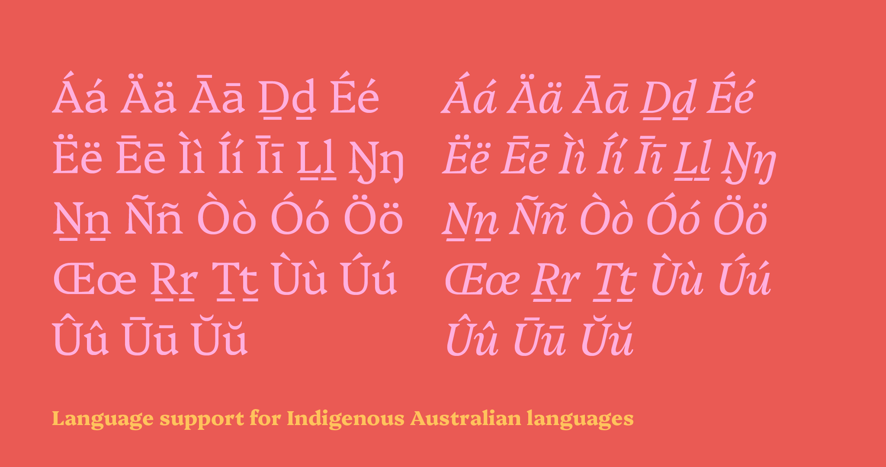
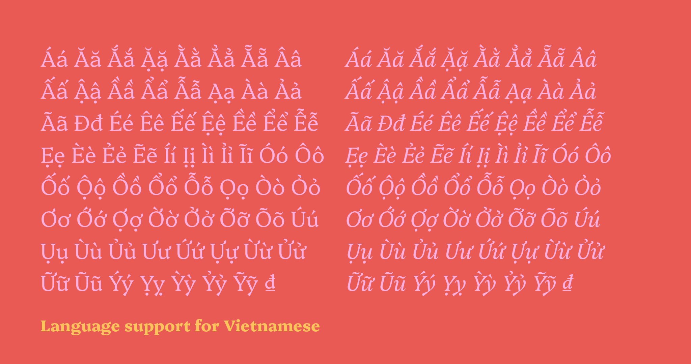
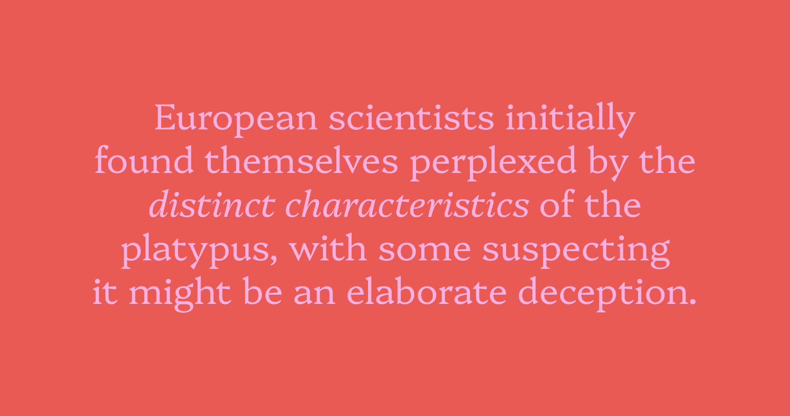

# Platypi

[![][Fontbakery]](https://d-sargent.github.io/platypi/fontbakery/fontbakery-report.html)
[![][Universal]](https://d-sargent.github.io/platypi/fontbakery/fontbakery-report.html)
[![][GF Profile]](https://d-sargent.github.io/platypi/fontbakery/fontbakery-report.html)
[![][Outline Correctness]](https://d-sargent.github.io/platypi/fontbakery/fontbakery-report.html)
[![][Shaping]](https://d-sargent.github.io/platypi/fontbakery/fontbakery-report.html)

[Fontbakery]: https://img.shields.io/endpoint?url=https%3A%2F%2Fraw.githubusercontent.com%2Fd-sargent%2Fplatypi%2Fgh-pages%2Fbadges%2Foverall.json
[GF Profile]: https://img.shields.io/endpoint?url=https%3A%2F%2Fraw.githubusercontent.com%2Fd-sargent%2Fplatypi%2Fgh-pages%2Fbadges%2FGoogleFonts.json
[Outline Correctness]: https://img.shields.io/endpoint?url=https%3A%2F%2Fraw.githubusercontent.com%2Fd-sargent%2Fplatypi%2Fgh-pages%2Fbadges%2FOutlineCorrectnessChecks.json
[Shaping]: https://img.shields.io/endpoint?url=https%3A%2F%2Fraw.githubusercontent.com%2Fd-sargent%2Fplatypi%2Fgh-pages%2Fbadges%2FShapingChecks.json
[Universal]: https://img.shields.io/endpoint?url=https%3A%2F%2Fraw.githubusercontent.com%2Fd-sargent%2Fplatypi%2Fgh-pages%2Fbadges%2FUniversal.json

Inspired by the enigmatic [platypus](https://platypus.asn.au), _Platypi_ blends sharp and dramatic wedge serifs with more conventional curves and proportions to achieve a practical text typeface with a unique and distinctive visual rhythm. Heavier weights push this tension further with increased stroke tapering and overall contrast. The name _Platypi_ is a term commonly used as the plural of platypus, allthough this term is technically incorrect.

The typeface features five weights with matching italic styles and language support for Indigenous Australian and Vietnamese languages.

## About the Designer

David Sargent is an Australian academic and designer living and working on Jagera and Turrbal land. 

David is Creative Director of [Liveworm](https://liveworm.com.au), a work-integrated learning incubator within the [Queensland College of Art & Design](https://www.griffith.edu.au/arts-education-law/queensland-college-art-design), Griffith University. Liveworm operates as a working design studio for students to engage with a broad range of ‘real world’ projects for not-for-profit, cultural, educational, and small to medium commercial clients. 

As a design researcher, David is interested in how creative practice can engage, communicate, and spark social change. His studio practice focuses on typography, expressive lettering, and disruptive augmented reality, with creative works exhibited in Australian and international galleries. He releases typefaces under the moniker Bolt Cutter Type.

## Contributors

The original design was developed while studying at Type West under the guidance of:

* Juan Villanueva [Website](http://www.juankafka.com)
* Lynne Yun [Website](http://www.lynneyun.com)
* Gen Ramirez [Website](https://genramirez.com)

Some timely advice on serif design was provided by:

* David Jonathan Ross [Website](https://djr.com)

Additional design advice was provided by:

* Troy Leinster [Website](https://www.leinstertype.com)

This project is dedicated to the memory of Donald Welch. A shame you never got to see it finished.

## Building

Fonts are built automatically by GitHub Actions - take a look in the "Actions" tab for the latest build.

If you want to build fonts manually on your own computer:

* `make build` will produce font files.
* `make test` will run [FontBakery](https://github.com/googlefonts/fontbakery)'s quality assurance tests.
* `make proof` will generate HTML proof files.

The proof files and QA tests are also available automatically via GitHub Actions - look at https://d-sargent.github.io/platypi.

## Changelog

**January 2024. Version 0.4**
* Vertical metrics added
* Kerning added

**January 2024. Version 0.35**
* Support for Australian Indigenous languages added
* Support for Vietnamese language added

**January 2024. Version 0.30**
* Google Fonts Latin Core Character Set completed

**August 2023. Version 0.20**
* Redrawn design started and uploaded onto GitHub
* Upright roman design in light and extra bold weights
* Matching italic design in light and extra bold weights
* Reconfigured vertical metrics for larger x-height
* Streamlined serif design

**December 2022. Version 0.10**
* Original design created while studying at Type West

The initial design for Platypi was produced while completing a Certificate in Type Design at Type West / Letterform Archive [Website](https://letterformarchive.org/type-west-online/) in 2022. The project aimed to create a 'latin' wedge serif model suitable for long-form text applications. This original design featured multiple upright weights alongside a single-weight italic style. In 2023–24, all letterforms were redrawn after reflection and time away from the project, along with matching italic styles and additional language support. 

## License

This Font Software is licensed under the SIL Open Font License, Version 1.1.
This license is available with a FAQ at
https://scripts.sil.org/OFL

## Repository Layout

This font repository structure is inspired by [Unified Font Repository v0.3](https://github.com/unified-font-repository/Unified-Font-Repository), modified for the Google Fonts workflow.
