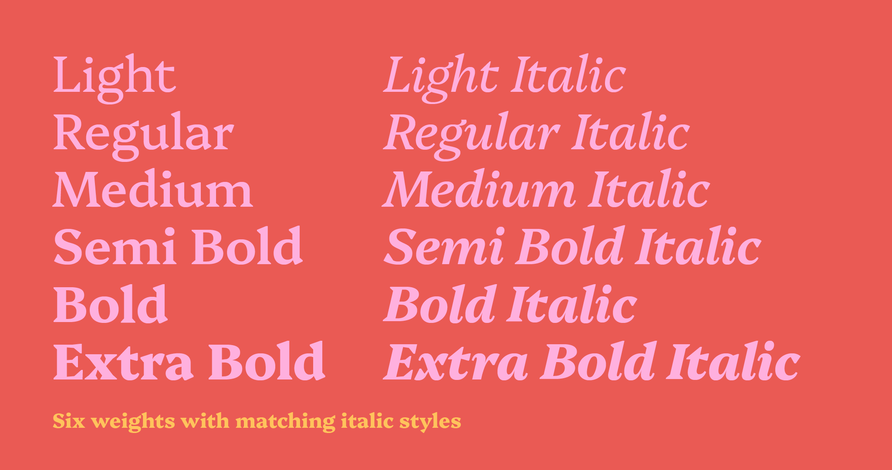
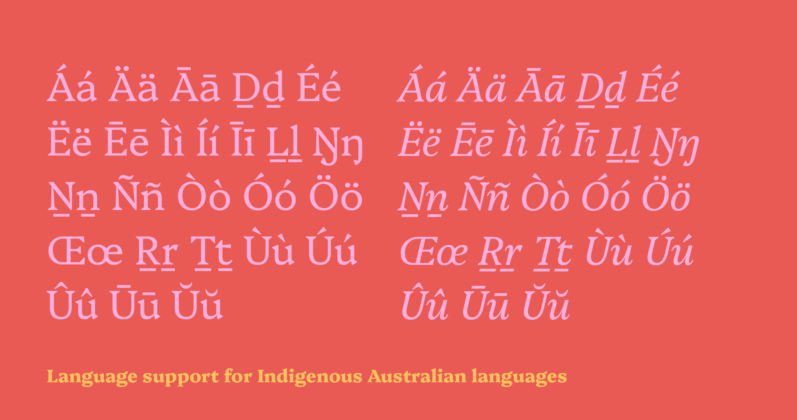
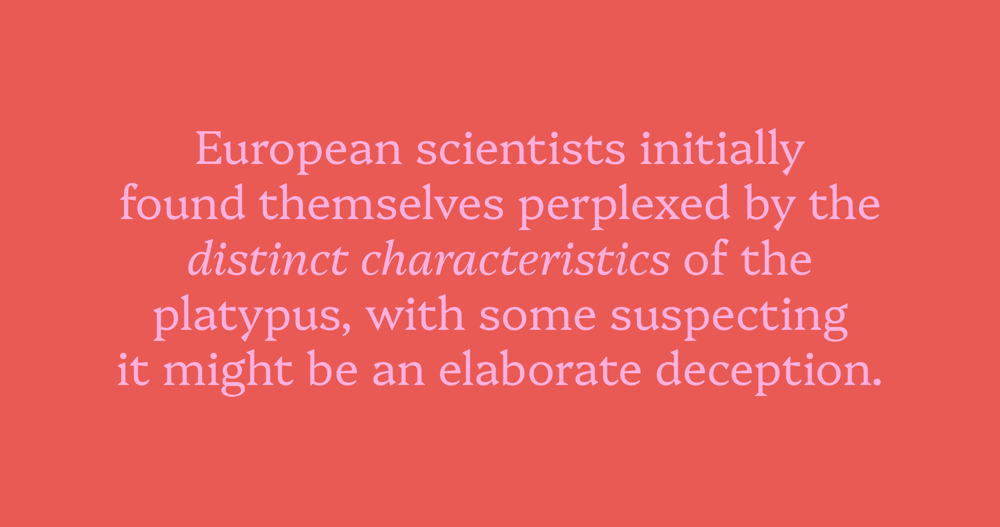

# Platypi

Drawing inspiration from the unusual blend of characteristics observed in the Australian platypus, _Platypi_ combines sharp, heavy wedge serifs usually seen in display faces with more conventional curves and proportions to achieve a practical text typeface with a unique and distinctive visual rhythm. The heavier weights push this tension further with increased stroke tapering and overall contrast. _Platypi_ features six weights with matching italic styles. It supports Indigenous Australian and Vietnamese languages, and includes the full Google Fonts Latin Plus Character Set.

Factoid: The word _Platypi_ is commonly used as the plural of platypus; however, it is a form of pseudo-Latin. The correct plural is _platypuses_.

## About the Designer

David Sargent is an Australian designer and educator living and working on Jagera and Turrbal land. 

He is Creative Director of [Liveworm](https://liveworm.com.au), a work-integrated learning incubator within the [Queensland College of Art & Design, Griffith University](https://www.griffith.edu.au/arts-education-law/queensland-college-art-design). Liveworm operates as a working design studio for students to engage with a broad range of ‘real world’ projects for not-for-profit, cultural, educational, and small to medium commercial clients. 

As a design practitioner, David is interested in how creative practice can engage, communicate, and spark social change. His studio practice focuses on typography, expressive lettering, and disruptive augmented reality, with creative works exhibited in Australian and international galleries. He releases typefaces under the moniker Bolt Cutter Type.

## Contributors

The original design was developed while studying at _Type West_ under the guidance of:

* [Juan Villanueva](http://www.juankafka.com)
* [Lynne Yun](http://www.lynneyun.com)
* [Gen Ramírez](https://genramirez.com)

Some timely advice on serif design (bigger!) was provided by:

* [David Jonathan Ross](https://djr.com)

Additional design advice as part of the _Type Masters_ program was provided by:

* [Troy Leinster](https://www.leinstertype.com/typemasters)

This project is dedicated to the memory of Donald Welch. A shame you never got to see it finished. Pip pip!

## Changelog

**February 2024. Version 1.20**
* Google Fonts Latin Plus Character Set completed
* Ready to onboard to Google Fonts library

**January 2024. Version 1.10**
* _Most_ Fontbakery fails corrected, a couple left I still can't work out...

**January 2024. Version 1.00**
* Vertical metrics added
* Kerning added

**January 2024. Version 0.40**
* Support for Australian Indigenous languages added
* Support for Vietnamese language added

**December 2023. Version 0.30**
* Google Fonts Latin Core Character Set completed

**August 2023. Version 0.20**
* Redrawn design started and uploaded onto GitHub
* Upright roman design in light and extra bold weights
* Matching italic design in light and extra bold weights
* Reconfigured font metrics for larger x-height and shorter ascenders/descenders
* Streamlined serif design

**December 2022. Version 0.10**
* Original design created while studying at Type West

The initial design for Platypi was produced while completing a Certificate in Type Design at [Type West](https://letterformarchive.org/type-west-online/) in 2022. The project aimed to create a wedge serif model suitable for long-form text applications. The original design completed at Type West featured multiple upright weights alongside a single-weight italic style. In 2023–24, all letterforms were redrawn after reflection and time away from the project, along with the addition of matching italic styles and additional language support. 

## Future roadmap

**Expand language support**

This project continues! In time, I am aiming to expand the [character set](https://github.com/googlefonts/glyphsets/tree/main/GF_glyphsets/Latin/glyphs) to cover the following:

* Google Fonts PriAfrican Character Set
* Google Fonts African Character Set
* Google Fonts Beyond Character Set

## License

This Font Software is licensed under the SIL Open Font License, Version 1.1.
This license is available with a FAQ at
https://scripts.sil.org/OFL

## Repository Layout

This font repository structure is inspired by [Unified Font Repository v0.3](https://github.com/unified-font-repository/Unified-Font-Repository), modified for the Google Fonts workflow.
